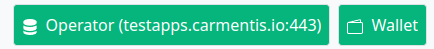

# Carmentis Application Example - Hello World (ExpressJS)

This repository contains the "Hello World" application in Carmentis, written using ExpressJS.
We have designed this application as a frictionless tutorial, in which you will discover the following key points:
1. You will learn the minimal architecture of an application in the Carmentis workflow.
2. You will learn the minimal configuration required.
3. You will learn how to use the different SDK to develop your own application.


## Motivation
The goal is to construct a publicly-available messaging board, in which anyone can post a message, later being 
displayed in the public board. 

## Installation
Before to dive in all the technical details, several parts have to be carefully installed.

### Installing NodeJS


### Installing Wallet of Carmentis
To agree on the sending of your message, you will relies on digital signature, authenticating the message your are sending
in the board. Don't worry, in this tutorial and even the others, no signature key pair generation is required, it is
completely transparent for you, thanks to the [wallet of Carmentis](https://docs.carmentis.io/).

The wallet of carmentis takes the form of an extension in your browser, from which every approval steps is based.
We refer you to the installation guide ([here](https://docs.carmentis.io/)) to install the wallet in your favorite browser.

### Launching the application server
Launching the NodeJS web server (which is our application) is done with the following command:
```shell
nmp install && node app.mjs
```

You can observe that everything works by looking at the address specified in the `.env` file (by default, it is `http://localhost:80`).
Once in your browser, observe the "Operator" and "Wallet" notifications, which should be **green** as shown below:



## ToDo
- [X] Compile the application-sdk instead of building it using core (from Source). 
- [ ] Talk about the Wallet and how to configure it.
- [X] Notification if the wallet is detected or not
- [X] Notification if the operator is up or not.
- [ ] Integration of a pop-up for an easier qr-code launch during the approval step.


### Preparing all the necessary pieces of data
- OrganizationID ?

