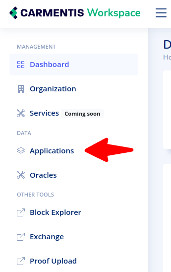
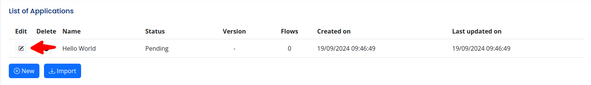
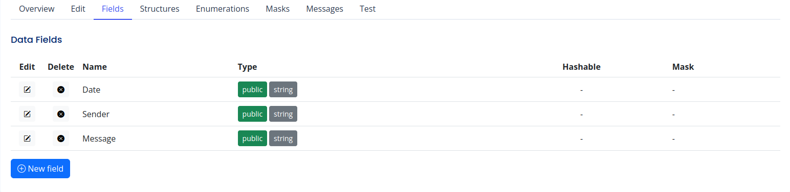

# Carmentis Application Example - Hello World (ExpressJS)

This repository contains the "Hello World" application in Carmentis, written using ExpressJS.
We have designed this application as a frictionless tutorial, in which you will discover the following key points:
1. You will learn the minimal architecture of an application in the Carmentis workflow.
2. You will learn the minimal configuration required.
3. You will learn how to use the different SDK to develop your own application.


## Motivation
The goal is to construct a publicly-available messaging board, in which anyone can post a message, later being 
displayed in the public board. 

## Installation
Before to dive in all the technical details, several parts have to be carefully installed.

### Step 1: Installing NodeJS
This "Hello World" application has been developed using NodeJS that should be installed in your system. The installation
of NodeJS (as well as `npm`) depends on your system in configuration, we refer to the official NodeJS installation page 
([here](http:s//https://nodejs.org/en/download/package-manager)).

### Step 2: Installing Wallet of Carmentis
To agree on the sending of your message, you will relies on digital signature, authenticating the message your are sending
in the board. Don't worry, in this tutorial and even the others, no signature key pair generation is required, it is
completely transparent for you, thanks to the [wallet of Carmentis](https://docs.carmentis.io/).

The wallet of Carmentis takes the form of an extension in your browser, from which every approval steps is based.
We refer you to the installation guide ([here](https://docs.carmentis.io/docs/wallet)) to install the wallet in your favorite browser.


### Step 3: Configuring the Wallet
Once installed, you have to create your personal account (which is ultimately your signature key pair). Again, we refer
you to the wallet configuration page in the documentation ([here](https://docs.carmentis.io/docs/wallet/configuration)).
To verify that your account has been successfully created, try to authenticate yourself at login page of Carmentis ([here](https://data.testapps.carmentis.io/workspace/sign-in)).

### Step 4: Create your application in the Carmentis workspace
To interact with the system of Carmentis (including the already running operator, the blockchain and so on), it is 
necessary to declare your application in your [personnal workspace](https://data.testapps.carmentis.io/workspace).
Note that if you are not logged in already, you will be automatically redirected to the login page.

Observe on the left of the workspace page, the "Applications" section as shown below:

Create a new application using the `New` button and insert a name of your choice (the name you provide is not relevant).
For simplicity, assume that our application is called "Hello World".
A new row describing your freshly created application should appear.  Click in the Edit field as shown below:



At this point, your application is declared to Carmentis, but you must specify now *what* Carmentis is supposed to deal with,
namely your data. For the "Hello World" application, three (public) fields have to be declared:
- `Date` of type `string`
- `Sender` of type `string`
- `Message` of type `string`

To declare these three fields, go to the `Fields` section and for each of them, click on `New Field`, enter the name of 
the field (**Note: every field's name is case-sensitive**), made it public by clicking on `Public Data` and finalize
using the `Confirm` button. Once all fields have been declared, you should obtain the following (the order of the variables is not relevant):


Then, click on `Publish` to finalize the declaration of the application. In the `Overview` section is displayed the 
ID of your application as well as the version number.

> [!NOTE]
> The ID of your application is set once and never change. Nevertheless, you are still allowed to apply modification
> to your application: The publication of an updated application leads to an incrementation of the application's version 
> number. To use the updated application, only update the version number to match the latest version.


### Step 5: Configuring the environment variables
In the `.env.example` file, some variables has to be modified carefully. First, duplicate the `.env.example` file and 
rename the duplicated file as `.env`. Only two variables has to be modified, namely `CARMENTIS_APPLICATION_ID` and `CARMENTIS_APPLICATION_VERSION`.

> [!NOTE]
> The `CARMENTIS_APPLICATION_ID` and `CARMENTIS_APPLICATION_VERSION` values are displayed in your workspace
> ([here](https://data.testapps.carmentis.io/workspace)) in your application under the `Overview` section.

### Step 6: Launching the application server
Launching the NodeJS web server (which is our application) is done with the following command:
```shell
# On Linux
nmp install && node app.mjs

# On Windows
TODO
```

You can observe that everything works by looking at the address specified in the `.env` file (by default, it is `http://localhost:80`).
Once in your browser, observe the "Operator" and "Wallet" notifications, which should be **green** as shown below:


## ToDo
- [X] Compile the application-sdk instead of building it using core (from Source). 
- [X] Talk about the Wallet and how to configure it.
- [X] Notification if the wallet is detected or not
- [X] Notification if the operator is up or not.
- [ ] Integration of a pop-up for an easier qr-code launch during the approval step.


